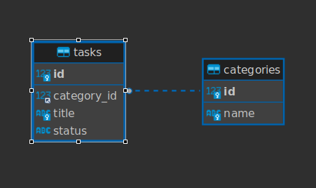

# Planner-API

Este projeto é uma API baseada em Express.js que faz consultas a um banco de dados MySQL. A finalidade da aplicação é armazenar e prover dados para aplicações de gerenciamento de tarefas pessoais.
Um exemplo de aplicação que utiliza a API é: https://github.com/Caique27/My-Planner

A API pode ser acessada através da URL: https://planner-api-cosp.onrender.com ou iniciada localmente(Veja a seção "Rodando localmente")

## Stack utilizada


## Rodando localmente

Clone o projeto

```bash
  git clone https://https://github.com/Caique27/Planner-API.git
```

Entre no diretório do projeto

```bash
  cd Planner-API
```

Instale as dependências

```bash
  npm install
```

Inicie o servidor

```bash
  npm start
```

Acesse a API através da URL:

```bash
  https://localhost:8877/
```

## Documentação da API

#### Retorna todas as tarefas agrupadas por categoria

```http
  GET /tasks/get
```

#### Retorna as categorias existentes

```http
  GET /categories/get
```

#### Cria uma categoria

```http
  POST /categories/create
```

###### Parâmetros do corpo da requisição

| Parâmetro | Tipo     | Descrição                                          |
| :-------- | :------- | :------------------------------------------------- |
| `name`    | `string` | **Obrigatório**. O nome da categoria a ser criada. |

#### Cria uma tarefa

```http
  POST /tasks/create
```

###### Parâmetros do corpo da requisição

| Parâmetro     | Tipo     | Descrição                                                       |
| :------------ | :------- | :-------------------------------------------------------------- |
| `title`       | `string` | **Obrigatório**. O nome da tarefa a ser criada.                 |
| `category_id` | `int`    | **Obrigatório**. O id da categoria da qual a tarefa fará parte. |

#### Renomeia uma categoria

```http
  PUT /categories/change/${id}
```

###### Parâmetros do endereço da requisição

| Parâmetro | Tipo  | Descrição                                              |
| :-------- | :---- | :----------------------------------------------------- |
| `id`      | `int` | **Obrigatório**. O id da categoria que será renomeada. |

###### Parâmetros do corpo da requisição

| Parâmetro | Tipo     | Descrição                                  |
| :-------- | :------- | :----------------------------------------- |
| `name`    | `string` | **Obrigatório**. O novo nome da categoria. |

#### Altera o status de uma tarefa para "feito" ou "não feito"

```http
  PUT /tasks/change/${id}
```

###### Parâmetros do endereço da requisição

| Parâmetro | Tipo  | Descrição                                                  |
| :-------- | :---- | :--------------------------------------------------------- |
| `id`      | `int` | **Obrigatório**. O id da tarefa cujo status será alterado. |

#### Apaga uma categoria

```http
  DELETE /categories/delete/${id}
```

###### Parâmetros do endereço da requisição

| Parâmetro | Tipo  | Descrição                                            |
| :-------- | :---- | :--------------------------------------------------- |
| `id`      | `int` | **Obrigatório**. O id da categoria que será apagada. |

#### Apaga uma tarefa

```http
  DELETE /tasks/delete/${id}
```

###### Parâmetros do endereço da requisição

| Parâmetro | Tipo  | Descrição                                         |
| :-------- | :---- | :------------------------------------------------ |
| `id`      | `int` | **Obrigatório**. O id da tarefa que será apagada. |

## Documentação de erros da API

| Código | Descrição                                           |
| :----- | :-------------------------------------------------- |
| `1`    | A rota não existe.                                  |
| `2`    | A API não pode se conectar com o banco de dados.    |
| `3`    | O corpo da requisição não possui o parâmetro name.  |
| `4`    | Já existe uma categoria com este nome.              |
| `5`    | O corpo da requisição não possui o id da categoria. |
| `6`    | O corpo da requisição não possui o parâmetro title. |
| `7`    | Não existe categoria com id informado.              |
| `8`    | Já existe um tarefa com este nome nesta categoria.  |
| `100`  | Outro erro(descrito na resposta).                   |

## Estrutura do Banco de Dados



-   Os dados da aplicação são armazenados em um banco de dados relacional MySQL que utiliza duas tabelas interligadas pela Foreign Key "category_id", que é a primary key "id" na tabela "categorias".

## Funcionalidades

-   Consultar tarefas e suas respectivas categorias
-   Criar e apagar tarefas e categorias
-   Atualizar tarefas e informações das tarefas e categorias
-   Hospedagem virtual que dispensa instalação para acessar os recursos da aplicação

## Contato

Pesquise pelo nome de usuário ou clique nos ícones.

[](https://github.com/Caique27)
[](https://www.linkedin.com/in/caique-alves-/)

